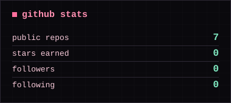
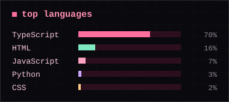

  

 

 

## Skills

**Programming Languages**

**Core Concepts**

**Web & Tools**

 

## GitHub stats

 

## Real-life projects

<table>
  <tr>
    <td align="center" width="33%">
      <b>ejn website</b> 
      <a href="https://ejn-website.netlify.app">ejn-website.netlify.app</a>
    </td>
    <td align="center" width="33%">
      <b>Student Study Planner</b>
    </td>
    <td align="center" width="33%">
      <b>SuperMarket Billing System</b>
    </td>
  </tr>
</table>

